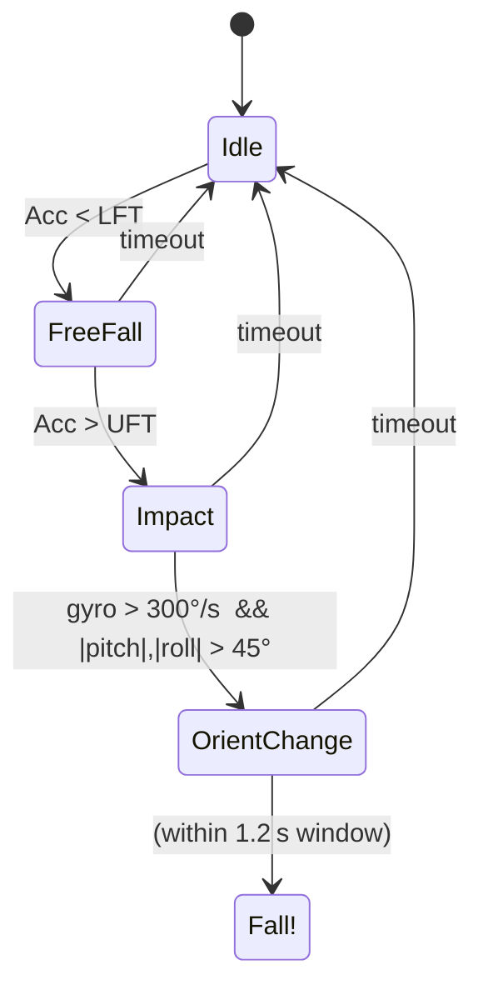

# Fall-Dectection-with-Arduino-UNO-HC-05-MPU-6050
# 🤸‍♂️ MPU‑6050 Fall‑Detection System

**Arduino Uno • MPU‑6050 IMU • HC‑05 Bluetooth**
Rajatkant Nayak · Anasuya Satapathy — supervised by Prof. Alessandro Pozzebon

> Real‑time fall detection with adaptive thresholds, complementary/Kalman fusion, JSON Bluetooth alerts, and a serial CLI for on‑the‑fly tuning.

---

## 📚 Table of Contents

1. [Project Overview](#project-overview)
2. [Key Features](#key-features)
3. [Bill of Materials](#bill-of-materials)
4. [Wiring Diagram](#wiring-diagram)
5. [Firmware Flashing](#firmware-flashing)
6. [State‑Machine & Algorithm](#state-machine--algorithm)
7. [Serial CLI Reference](#serial-cli-reference)
8. [Bluetooth Payload](#bluetooth-payload)
9. [Calibration & Tuning](#calibration--tuning)
10. [Road‑map](#road-map)
11. [License](#license)

---

## Project Overview

Falls are a leading cause of injury among older adults and patients with mobility challenges. This project delivers a **wearable fall‑detection node** that:

* Samples a 6‑axis IMU at 100 Hz.
* Detects the classic *free‑fall → impact → orientation change* sequence within a 1.2 s window.
* Sends an immediate JSON alert over Bluetooth (HC‑05) to any Android/iOS listener.
* Offers a live serial command line to tweak thresholds without re‑flashing.

The firmware is contained in [`fall_detection_mpu6050.ino`](./fall_detection_mpu6050.ino) (see canvas ➜ **Fall Detection Mpu6050**).

---

## Key Features

| ✔︎ Feature                        | Details                                                                          |
| --------------------------------- | -------------------------------------------------------------------------------- |
| **High‑rate ISR sampling**        | Timer‑driven 100 Hz reads, independent of `loop()` timing.                       |
| **Butterworth LPF**               | 1‑pole low‑pass on each accel/gyro channel for noise suppression.                |
| **Complementary + Kalman fusion** | 98 % gyro / 2 % accel, then 1‑axis Kalman smooth for pitch & roll.               |
| **Adaptive thresholds**           | Learns baseline `g` for first 10 s, auto‑refreshes every 5 min.                  |
| **3‑stage FSM**                   | Free‑fall (Acc < 0.4 g) ➜ Impact (Acc > 2.8 g) ➜ Orientation (> 45° or 300 °/s). |
| **JSON alerts**                   | `{ "event":"fall", "impact":2.9, "pitch":57, ... }`                              |
| **On‑board LED**                  | Triple‑blink for confirmed fall.                                                 |
| **Serial CLI**                    | `help`, `get thr`, `set lft`, `set uft`, `stat`.                                 |
| **Modular**                       | Add barometer, GPS or LoRa by extending the ISR / alert routines.                |

---

## Bill of Materials

| Qty | Part                         | Link / Notes                           |
| --- | ---------------------------- | -------------------------------------- |
| 1   | **Arduino Uno** R3           | Any clone works; 16 MHz / 5 V.         |
| 1   | **MPU‑6050** breakout        | GY‑521 or similar I²C board.           |
| 1   | **HC‑05 Bluetooth module**   | Default baud 9600 bd.                  |
| —   | Male‑female jumper wires     |                                        |
| 1   | 3.3 V regulator *(optional)* | If you want to power HC‑05 at 3.3 V.   |
| 2   | Resistors (1 k Ω + 2 k Ω)    | Voltage divider for Uno‑TX ➜ HC‑05‑RX. |

> **Power:** 5 V USB or Li‑Ion + 5 V boost; current draw ≈ 60 mA with Bluetooth connected.

---

## Wiring Diagram

```text
     Arduino Uno             MPU‑6050            HC‑05
  ┌─────────────────┐     ┌────────────┐     ┌────────────┐
  │ 5V  ────────────┼────▶ VCC        │     │ VCC ◀──────┼─ 5V
  │ GND ────────────┼────▶ GND        │     │ GND ◀──────┼─ GND
  │ A4 (SDA) ───────┼────▶ SDA        │     │            │
  │ A5 (SCL) ───────┼────▶ SCL        │     │            │
  │ D0 (RX) ◀─ TXD  │                   │ TXD ▶─ D1 (TX) │ via 1k/2k divider
  │ D1 (TX) ── RXD ▶│                   │ RXD ◀──────────┘
  └─────────────────┘     └────────────┘     └────────────┘
```

> *INT pin from MPU‑6050 is ********not required******** but can be used for DMP flavours.*

---

## Firmware Flashing

1. **Install libraries:** `I2Cdevlib‑MPU6050`, `SimpleKalmanFilter`, `ArduinoJson` via *Tools ▸ Manage Libraries…*
2. **Open** `fall_detection_mpu6050.ino` in Arduino IDE 2.x.
3. Set **Board** = *Arduino Uno* → pick the COM port.
4. Click **Upload** (≈ 30 kB flash).
5. Open **Serial Monitor** @ 9600 baud → type `help` to see commands.

---

## State‑Machine & Algorithm



*Dynamic thresholds* — during the first 10 s the code tracks the moving average of |a|; thresholds LFT=0.4 g and UFT=2.8 g are scaled from this baseline.

---

## Serial CLI Reference

| Command       | Function                                          |   |   |
| ------------- | ------------------------------------------------- | - | - |
| `help`        | List commands                                     |   |   |
| `get thr`     | Print current LFT & UFT in g                      |   |   |
| `set lft <g>` | Set new free‑fall threshold (e.g. `set lft 0.35`) |   |   |
| `set uft <g>` | Set new impact threshold                          |   |   |
| `stat`        | Instant pitch, roll,                              | a |   |

---

## Bluetooth Payload

Example message captured by a phone:

```json
{"event":"fall","ts":31782,"impact":3.1,"pitch":57.8,"roll":-11.3}
```

* `ts` — milliseconds since MCU reset
* `impact` — peak G‑force at Trigger‑2
* `pitch`, `roll` — complementary/Kalman estimate after impact

Decode this JSON in any mobile app or forward it to an MQTT broker via a BLE‑gateway.

---

## Calibration & Tuning

1. Place the sensor flat for 3 s after power‑up – this lets the Kalman filter zero gravity.
2. Use `set lft` / `set uft` to tighten or loosen sensitivity.
3. Adjust `ORI_THR` (°) if you find false positives during sports or rapid sit/stand.
4. For wheelchair users, lower `ORI_THR` to \~25 ° and increase `WINDOW_MS` to 2 s.

---

## Road‑map

* **Pressure fusion:** Use BMP‑180 to detect sudden altitude drop.
* **BLE 5.0:** Replace HC‑05 with HM‑19 or nRF52 for lower power.
* **ML‑Edge:** Feed 3‑axis windows into a small decision‑tree to cut false alarms.
* **Battery sleeve:** 1000 mAh Li‑Po + TP4056 charger board for 24 h runtime.

---

## License

MIT – see `LICENSE` in this repo.

> *Built with ♥ at the Universitof Padova, 2025.*
